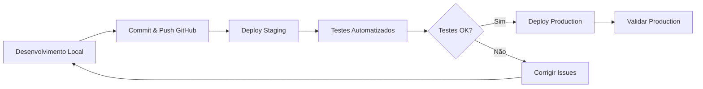

# 🚀 Guia de Deployment

Este documento descreve o processo de deployment para os ambientes de **Staging** e **Produção** no Heroku.

## 📊 Ambientes

### 🔵 Staging (Homologação)
- **App Heroku**: `fiap-mle-bookstore-staging`
- **URL**: https://fiap-mle-bookstore-staging-d571c9f02bed.herokuapp.com
- **API Base**: https://fiap-mle-bookstore-staging-d571c9f02bed.herokuapp.com/api/v1
- **Swagger**: https://fiap-mle-bookstore-staging-d571c9f02bed.herokuapp.com/api/v1/docs
- **Git Remote**: `staging`

### 🟢 Production (Produção)
- **App Heroku**: `fiap-mle-bookstore-prod`
- **URL**: https://fiap-mle-bookstore-prod-d748bdd0abdc.herokuapp.com
- **API Base**: https://fiap-mle-bookstore-prod-d748bdd0abdc.herokuapp.com/api/v1
- **Swagger**: https://fiap-mle-bookstore-prod-d748bdd0abdc.herokuapp.com/api/v1/docs
- **Git Remote**: `production`

---

## 🔄 Workflow de Deployment

### Fluxo Recomendado



### Regras de Deployment

1. **SEMPRE** fazer deploy em **staging** primeiro
2. **NUNCA** fazer deploy direto em produção sem validar em staging
3. Executar testes automatizados em staging antes de promover para produção
4. Manter os ambientes sincronizados

---

## 🛠️ Scripts de Deployment

### 1. Deploy Automatizado (Recomendado)

```bash
# Deploy apenas para staging
./scripts/deploy.sh staging

# Deploy para staging, testar, e promover para production
./scripts/deploy.sh production
```

O script `deploy.sh` executa:
- ✅ Deploy para o ambiente especificado
- ✅ Aguarda deployment completar
- ✅ Executa testes automatizados
- ✅ Valida todos os endpoints críticos
- ✅ Para produção: requer confirmação manual após validar staging

### 2. Teste Rápido de Ambiente

```bash
# Testar staging
./scripts/test_env.sh staging

# Testar production
./scripts/test_env.sh production
```

O script `test_env.sh` valida:
- ✅ Health check
- ✅ Autenticação (login)
- ✅ Endpoints de livros
- ✅ Endpoint de busca
- ✅ Endpoint de categorias
- ✅ Swagger UI

---

## 📝 Deployment Manual

### Staging

```bash
# 1. Verificar branch atual
git branch

# 2. Commit suas alterações
git add .
git commit -m "feat: sua descrição"

# 3. Push para GitHub
git push origin main

# 4. Deploy para staging
git push staging main

# 5. Aguardar deployment (30-60 segundos)
heroku logs --tail --app fiap-mle-bookstore-staging

# 6. Testar staging
./scripts/test_env.sh staging
```

### Production (após validar staging)

```bash
# 1. Validar que staging está funcionando
./scripts/test_env.sh staging

# 2. Deploy para production
git push production main

# 3. Aguardar deployment
heroku logs --tail --app fiap-mle-bookstore-prod

# 4. Testar production
./scripts/test_env.sh production
```

---

## ✅ Checklist de Validação

### Pre-Deployment

- [ ] Código commitado e pushed para GitHub
- [ ] Testes locais executados (`pytest`)
- [ ] Linter executado sem erros
- [ ] README atualizado (se necessário)

### Post-Deployment Staging

- [ ] Health check retorna `healthy`
- [ ] Login funciona (admin/user)
- [ ] Endpoints de livros respondem corretamente
- [ ] Endpoint de busca funciona
- [ ] Endpoint de categorias funciona
- [ ] Swagger UI acessível e funcional
- [ ] Logs sem erros críticos

### Post-Deployment Production

- [ ] Todos os testes de staging passaram
- [ ] Health check retorna `healthy`
- [ ] Login funciona
- [ ] Todos os endpoints críticos funcionando
- [ ] Swagger UI acessível
- [ ] Performance aceitável
- [ ] Logs monitorados por 5-10 minutos

---

## 🔧 Comandos Úteis

### Verificar Status dos Apps

```bash
# Staging
heroku ps --app fiap-mle-bookstore-staging
heroku info --app fiap-mle-bookstore-staging

# Production
heroku ps --app fiap-mle-bookstore-prod
heroku info --app fiap-mle-bookstore-prod
```

### Ver Logs

```bash
# Staging - últimas 100 linhas
heroku logs --tail --num 100 --app fiap-mle-bookstore-staging

# Production - últimas 100 linhas
heroku logs --tail --num 100 --app fiap-mle-bookstore-prod
```

### Restart App

```bash
# Staging
heroku restart --app fiap-mle-bookstore-staging

# Production
heroku restart --app fiap-mle-bookstore-prod
```

### Escalar Dynos

```bash
# Verificar dynos ativos
heroku ps --app fiap-mle-bookstore-staging

# Escalar para 1 dyno
heroku ps:scale web=1 --app fiap-mle-bookstore-staging

# Desligar (0 dynos)
heroku ps:scale web=0 --app fiap-mle-bookstore-staging
```

### Configurar Variáveis de Ambiente

```bash
# Listar variáveis
heroku config --app fiap-mle-bookstore-staging

# Adicionar variável
heroku config:set VARIABLE_NAME=value --app fiap-mle-bookstore-staging

# Remover variável
heroku config:unset VARIABLE_NAME --app fiap-mle-bookstore-staging
```

---

## 🐛 Troubleshooting

### Erro: "Application Error"

```bash
# 1. Verificar logs
heroku logs --tail --app [app-name]

# 2. Verificar dynos
heroku ps --app [app-name]

# 3. Restartar app
heroku restart --app [app-name]

# 4. Verificar configuração
heroku config --app [app-name]
```

### Erro: "No web processes running (H14)"

```bash
# Escalar dyno para 1
heroku ps:scale web=1 --app [app-name]
```

### Deploy Falhou

```bash
# 1. Ver logs do build
heroku logs --tail --app [app-name]

# 2. Verificar Procfile
cat Procfile

# 3. Verificar runtime.txt
cat runtime.txt

# 4. Fazer rollback se necessário
heroku rollback --app [app-name]
```

### Staging OK mas Production com Erro

```bash
# 1. Comparar configurações
heroku config --app fiap-mle-bookstore-staging > staging_config.txt
heroku config --app fiap-mle-bookstore-prod > prod_config.txt
diff staging_config.txt prod_config.txt

# 2. Sincronizar configurações se necessário
```

---

## 🔐 Segurança

### Variáveis de Ambiente Requeridas

Ambos os ambientes devem ter configuradas:

```bash
# JWT e Secret Keys
JWT_SECRET_KEY=<valor-seguro-gerado>
SECRET_KEY=<valor-seguro-gerado>

# Flask
FLASK_ENV=production
FLASK_DEBUG=False
```

### Gerar Chaves Seguras

```bash
# Gerar chave aleatória
python -c "import secrets; print(secrets.token_hex(32))"
```

### Configurar em Staging

```bash
heroku config:set JWT_SECRET_KEY=$(python -c "import secrets; print(secrets.token_hex(32))") --app fiap-mle-bookstore-staging
heroku config:set SECRET_KEY=$(python -c "import secrets; print(secrets.token_hex(32))") --app fiap-mle-bookstore-staging
```

### Configurar em Production

```bash
heroku config:set JWT_SECRET_KEY=$(python -c "import secrets; print(secrets.token_hex(32))") --app fiap-mle-bookstore-prod
heroku config:set SECRET_KEY=$(python -c "import secrets; print(secrets.token_hex(32))") --app fiap-mle-bookstore-prod
```

---

## 📊 Monitoramento

### Métricas Importantes

- **Response Time**: < 500ms para endpoints simples
- **Error Rate**: < 1%
- **Uptime**: > 99%
- **Memory Usage**: < 80% do limite do dyno

### Ferramentas

- **Heroku Metrics**: Dashboard no Heroku
- **Logs**: `heroku logs --tail`
- **Health Endpoint**: `/health`
- **Application Metrics**: Disponível no Swagger

---

## 📅 Processo de Release

### 1. Desenvolvimento

```bash
git checkout -b feature/nova-funcionalidade
# ... desenvolver ...
git commit -m "feat: nova funcionalidade"
git push origin feature/nova-funcionalidade
```

### 2. Merge para Main

```bash
# Após code review
git checkout main
git merge feature/nova-funcionalidade
git push origin main
```

### 3. Deploy Staging

```bash
./scripts/deploy.sh staging
```

### 4. Validação

```bash
./scripts/test_env.sh staging
# Testes manuais adicionais se necessário
```

### 5. Deploy Production

```bash
./scripts/deploy.sh production
```

### 6. Monitoramento

```bash
# Monitorar logs por 10-15 minutos
heroku logs --tail --app fiap-mle-bookstore-prod
```

---

## 🆘 Rollback

### Rollback Rápido

```bash
# Staging
heroku rollback --app fiap-mle-bookstore-staging

# Production
heroku rollback --app fiap-mle-bookstore-prod
```

### Rollback para Versão Específica

```bash
# Listar releases
heroku releases --app fiap-mle-bookstore-prod

# Rollback para versão específica
heroku rollback v42 --app fiap-mle-bookstore-prod
```

---

## 📞 Suporte

Em caso de problemas:

1. Verificar logs: `heroku logs --tail`
2. Consultar este documento
3. Verificar README.md
4. Abrir issue no GitHub

---

**Última atualização**: 27/11/2025  
**Versão**: 1.0.0

