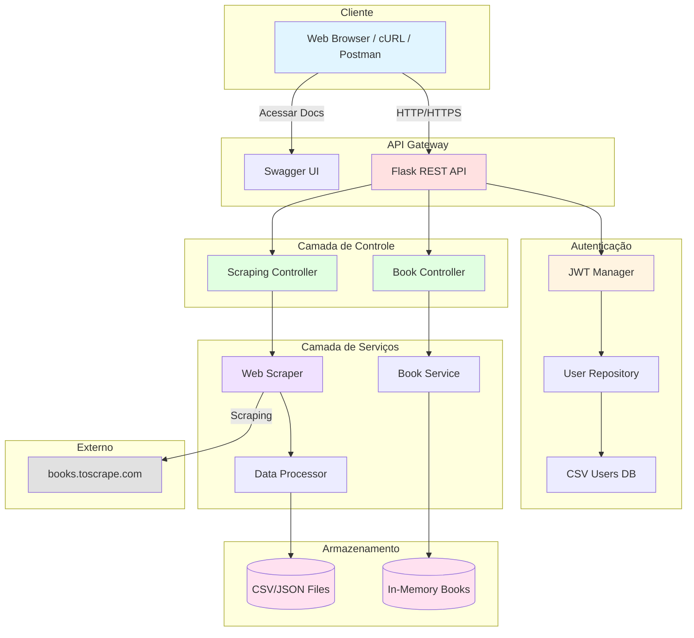
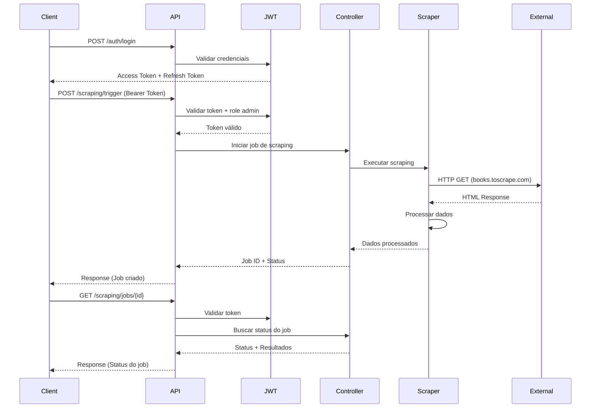

# 📚 FIAP MLE - Book Store Project

> **Tech Challenge** - Pós-Graduação em Machine Learning Engineering - FIAP

## 🎯 Sobre o Projeto

Este projeto faz parte do **Tech Challenge** do curso de **Pós-Graduação em Machine Learning Engineering** da **FIAP**. O objetivo é desenvolver uma solução completa de backend que integra três componentes principais:

1. **API REST** usando Flask com autenticação JWT para gerenciamento de livros
2. **Web Scraping** automatizado para coleta de dados de livros
3. **Sistema de Autenticação** com controle de acesso baseado em roles (RBAC)

### 🌐 Ambientes de Deploy

A aplicação possui dois ambientes no Heroku:

#### 🔵 Staging (Homologação)
- **URL**: https://fiap-mle-bookstore-staging-d571c9f02bed.herokuapp.com
- **API**: https://fiap-mle-bookstore-staging-d571c9f02bed.herokuapp.com/api/v1
- **Swagger**: https://fiap-mle-bookstore-staging-d571c9f02bed.herokuapp.com/api/v1/docs
- **Uso**: Testes e validação antes de produção

#### 🟢 Production (Produção)
- **URL**: https://fiap-mle-bookstore-prod-d748bdd0abdc.herokuapp.com
- **API**: https://fiap-mle-bookstore-prod-d748bdd0abdc.herokuapp.com/api/v1
- **Swagger**: https://fiap-mle-bookstore-prod-d748bdd0abdc.herokuapp.com/api/v1/docs
- **Uso**: Ambiente de produção estável

> 📘 **Guia de Deployment**: Consulte [DEPLOYMENT.md](DEPLOYMENT.md) para instruções detalhadas de deploy

### 🎓 Objetivos de Aprendizado

- Desenvolvimento de APIs RESTful com Flask
- Implementação de autenticação e autorização com JWT
- Web scraping responsável e processamento de dados
- Testes automatizados e documentação de APIs
- Deploy em ambiente de produção (Heroku)
- Boas práticas de desenvolvimento (Git, Docker, CI/CD)

### ⚡ Funcionalidades Principais

#### 🔐 Sistema de Autenticação JWT
- Login com usuário e senha
- Tokens de acesso (1 hora de validade)
- Tokens de renovação (30 dias de validade)
- Controle de acesso baseado em roles (RBAC)
- Registro de novos usuários
- Armazenamento seguro com hash bcrypt

#### 📚 Gerenciamento de Livros
- CRUD completo de livros (Create, Read, Update, Delete)
- Listagem com paginação e busca
- Filtro por título e autor
- Categorização de livros
- Estatísticas da coleção (total, preço médio, por categoria)
- Listagem de categorias disponíveis

#### 🕷️ Web Scraping Automatizado
- Coleta de dados de livros do site books.toscrape.com
- Scraping configurável (páginas, formato, URL)
- Processamento e exportação (JSON, CSV ou ambos)
- Sistema de jobs com rastreamento de status
- Execução via API (admin) ou CLI
- Logs detalhados de execução

#### 📖 Documentação Interativa
- Swagger UI completo e navegável
- Testes de endpoints direto no navegador
- Autenticação JWT integrada no Swagger
- Exemplos de request/response para todos os endpoints
- Schemas e validações documentadas

#### 🧪 Testes e Qualidade
- Testes unitários com pytest
- Cobertura de código
- Validação de autenticação e autorização
- Testes de integração dos endpoints

## 🏗️ Arquitetura do Sistema



### 📊 Fluxo de Dados



## 📁 Estrutura do Projeto

```
FIAP-MLE-book-store/
├── api/                          # Módulo da API REST
│   ├── auth/                     # Sistema de autenticação
│   │   ├── models.py            # Usuários (carrega de CSV)
│   │   ├── routes.py            # Login, refresh, register
│   │   └── decorators.py        # Proteção de rotas (admin_required)
│   ├── controllers/
│   │   ├── book_controller.py   # Lógica de livros
│   │   └── scraping_controller.py # Lógica de scraping
│   ├── app.py                   # Aplicação Flask + JWT
│   ├── config.py                # Configurações
│   ├── routes.py                # Rotas de livros
│   ├── scraping_routes.py       # Rotas de scraping
│   ├── swagger_config.py        # Configuração Swagger/OpenAPI
│   └── wsgi.py                  # Entry point para Gunicorn
│
├── scraper/                      # Módulo de Web Scraping
│   ├── base_scraper.py          # Classe base
│   ├── book_scraper.py          # Scraper de livros
│   ├── data_processor.py        # Processamento (JSON/CSV)
│   └── main.py                  # CLI do scraper
│
├── data/
│   ├── users.csv                # Usuários da API
│   └── output/                  # Dados de scraping
│
├── tests/                       # Testes unitários
│   ├── test_api.py
│   ├── test_auth.py
│   ├── test_scraper.py
│   └── test_scraping.py
│
├── examples/                    # Exemplos de uso
│   ├── api_examples.py
│   ├── scraper_examples.py
│   └── auth_scraping_example.py
│
├── scripts/
│   └── create_user.py          # Gerenciar usuários
│
├── requirements.txt             # Dependências
├── run_api.py                  # Iniciar API
├── run_scraper.py              # Iniciar scraper
├── Procfile                    # Deploy Heroku
├── runtime.txt                 # Python version (Heroku)
├── app.json                    # Heroku app config
└── README.md                   # Este arquivo
```

## 🚀 Como Reproduzir o Projeto

### Pré-requisitos

- **Python 3.11+** instalado
- **Git** instalado
- **pip** atualizado (`pip install --upgrade pip`)
- *(Opcional)* **Docker** para containerização
- *(Opcional)* **Heroku CLI** para deploy

### 📋 Passo a Passo

#### 1. Clonar o Repositório

```bash
git clone https://github.com/giulianogimenez/FIAP-MLE-book-store.git
cd FIAP-MLE-book-store
```

#### 2. Criar Ambiente Virtual

```bash
# Criar ambiente virtual
python3 -m venv venv

# Ativar (macOS/Linux)
source venv/bin/activate

# Ativar (Windows)
venv\Scripts\activate
```

#### 3. Instalar Dependências

```bash
pip install -r requirements.txt
```

#### 4. Verificar Configuração

O projeto já vem com:
- ✅ Usuários padrão configurados (`data/users.csv`)
- ✅ Configurações de desenvolvimento prontas
- ✅ Documentação Swagger integrada

#### 5. Iniciar a API

```bash
python run_api.py
```

A API estará disponível em: **http://localhost:5000**

**📖 Documentação Swagger:** http://localhost:5000/api/v1/docs

#### 6. Testar a API

```bash
# Fazer login
curl -X POST http://localhost:5000/api/v1/auth/login \
  -H "Content-Type: application/json" \
  -d '{"username":"admin","password":"admin123"}'

# Acessar Swagger UI
# Abra no navegador: http://localhost:5000/api/v1/docs
```

---

## 🚀 Configuração do Ambiente

### 1. Criar ambiente virtual e instalar dependências

```bash
# Criar ambiente virtual
python3 -m venv venv

# Ativar (macOS/Linux)
source venv/bin/activate

# Ativar (Windows)
venv\Scripts\activate

# Instalar dependências
pip install -r requirements.txt
```

### 2. Iniciar a API

```bash
python run_api.py
```

A API estará disponível em: **http://localhost:5000**

**📖 Documentação Swagger:** http://localhost:5000/api/v1/docs

---

## 🔐 Autenticação e Login

### Usuários Padrão

A aplicação vem com dois usuários pré-configurados:

| Usuário | Senha | Role | Permissões |
|---------|-------|------|------------|
| `admin` | `admin123` | admin | Acesso completo + Scraping |
| `user` | `user123` | user | Apenas consulta de livros |

> ⚠️ **Importante:** Em produção, altere essas senhas!

### Como Fazer Login

#### 1. Login e Obter Token

**Request:**
```bash
curl -X POST http://localhost:5000/api/v1/auth/login \
  -H "Content-Type: application/json" \
  -d '{
    "username": "admin",
    "password": "admin123"
  }'
```

**Response:**
```json
{
  "access_token": "eyJhbGciOiJIUzI1NiIsInR5cCI6IkpXVCJ9...",
  "refresh_token": "eyJhbGciOiJIUzI1NiIsInR5cCI6IkpXVCJ9...",
  "user": {
    "username": "admin",
    "role": "admin"
  },
  "message": "Login successful"
}
```

#### 2. Usar o Token nas Requisições

Copie o `access_token` e use no header `Authorization`:

```bash
# Salvar token em variável
TOKEN="seu_access_token_aqui"

# Usar em requisições
curl http://localhost:5000/api/v1/books \
  -H "Authorization: Bearer $TOKEN"
```

#### 3. Exemplo Python

```python
import requests

# 1. Login
response = requests.post(
    "http://localhost:5000/api/v1/auth/login",
    json={
        "username": "admin",
        "password": "admin123"
    }
)

tokens = response.json()
access_token = tokens['access_token']

# 2. Usar token nas requisições
headers = {"Authorization": f"Bearer {access_token}"}

# 3. Fazer requisições autenticadas
books = requests.get(
    "http://localhost:5000/api/v1/books",
    headers=headers
)
print(books.json())
```

### Renovar Token (Refresh)

O access token expira em 1 hora. Use o refresh token para obter um novo:

```bash
curl -X POST http://localhost:5000/api/v1/auth/refresh \
  -H "Authorization: Bearer <refresh_token>"
```

---

## 📚 Documentação da API (Swagger)

### 🎯 Acesse a Documentação Interativa

A API possui documentação completa com Swagger/OpenAPI, disponível em:

**URL:** http://localhost:5000/api/v1/docs

Na documentação Swagger você pode:
- ✅ Ver todos os endpoints disponíveis
- ✅ Testar as requisições diretamente no navegador
- ✅ Ver exemplos de request/response
- ✅ Entender os parâmetros e schemas
- ✅ Autenticar com JWT e testar endpoints protegidos

### Como Usar o Swagger

1. **Acesse:** http://localhost:5000/api/v1/docs
2. **Fazer Login:**
   - Clique em "POST /api/v1/auth/login"
   - Clique em "Try it out"
   - Use: `{"username": "admin", "password": "admin123"}`
   - Execute e copie o `access_token`
3. **Autorizar:**
   - Clique no botão "Authorize" 🔒 (topo da página)
   - Digite: `Bearer seu_access_token_aqui`
   - Clique em "Authorize"
4. **Testar Endpoints:**
   - Agora você pode testar qualquer endpoint protegido!

---

## 📚 Documentação dos Endpoints

### 🔓 Autenticação (Público)

| Método | Endpoint | Descrição | Autenticação |
|--------|----------|-----------|--------------|
| POST | `/api/v1/auth/login` | Login e obter tokens JWT | Não requer |
| POST | `/api/v1/auth/refresh` | Renovar access token | Refresh token |
| GET | `/api/v1/auth/me` | Informações do usuário logado | Bearer token |
| POST | `/api/v1/auth/register` | Registrar novo usuário | Não requer |

#### Detalhes dos Endpoints de Autenticação

**POST /api/v1/auth/login**
- **Descrição**: Autentica usuário e retorna tokens JWT
- **Body**: `{"username": "admin", "password": "admin123"}`
- **Response**: Access token (1h) + Refresh token (30 dias)
- **Status**: 200 (sucesso), 401 (credenciais inválidas)

**POST /api/v1/auth/refresh**
- **Descrição**: Renova o access token usando refresh token
- **Header**: `Authorization: Bearer <refresh_token>`
- **Response**: Novo access token
- **Status**: 200 (sucesso), 401 (token inválido)

**GET /api/v1/auth/me**
- **Descrição**: Retorna informações do usuário autenticado
- **Header**: `Authorization: Bearer <access_token>`
- **Response**: `{"username": "admin", "role": "admin"}`
- **Status**: 200 (sucesso), 401 (não autenticado)

**POST /api/v1/auth/register**
- **Descrição**: Cria novo usuário (role padrão: user)
- **Body**: `{"username": "novouser", "password": "senha123"}`
- **Response**: Confirmação de criação
- **Status**: 201 (criado), 400 (usuário já existe)

---

### 📚 Books (Requer Bearer Token)

| Método | Endpoint | Descrição | Role Necessária |
|--------|----------|-----------|-----------------|
| GET | `/api/v1/books` | Listar livros (paginação, busca) | user/admin |
| GET | `/api/v1/books/search` | Buscar por título e/ou categoria | user/admin |
| GET | `/api/v1/books/:id` | Buscar livro por ID | user/admin |
| POST | `/api/v1/books` | Criar novo livro | user/admin |
| PUT | `/api/v1/books/:id` | Atualizar livro | user/admin |
| DELETE | `/api/v1/books/:id` | Deletar livro | user/admin |
| GET | `/api/v1/categories` | Listar todas as categorias | user/admin |
| GET | `/api/v1/stats` | Estatísticas da coleção | user/admin |

#### Detalhes dos Endpoints de Books

**GET /api/v1/books**
- **Descrição**: Lista todos os livros com paginação e busca
- **Query Params**: 
  - `page` (int): Número da página (padrão: 1)
  - `limit` (int): Livros por página (padrão: 10)
  - `search` (string): Buscar por título ou autor
- **Response**: Lista de livros + metadados de paginação
- **Exemplo**: `/api/v1/books?page=1&limit=5&search=Python`

**GET /api/v1/books/search**
- **Descrição**: Busca livros por título e/ou categoria (filtros combinados)
- **Query Params**: 
  - `title` (string, opcional): Busca parcial no título (case-insensitive)
  - `category` (string, opcional): Busca exata por categoria (case-insensitive)
- **Response**: Lista de livros encontrados (array vazio se nenhum resultado)
- **Status**: 200 (sempre, mesmo sem resultados)
- **Exemplos**: 
  - `/api/v1/books/search?title=Python` - Busca por título
  - `/api/v1/books/search?category=Technology` - Busca por categoria
  - `/api/v1/books/search?title=Machine&category=Technology` - Busca combinada
- **Exemplo de resposta**:
```json
{
  "books": [
    {
      "id": 1,
      "title": "Python Machine Learning",
      "author": "Sebastian Raschka",
      "isbn": "978-1789955750",
      "price": 44.99,
      "category": "Technology"
    }
  ],
  "total": 1
}
```

**GET /api/v1/books/:id**
- **Descrição**: Busca livro específico por ID
- **Path Param**: `id` (int)
- **Response**: Detalhes completos do livro
- **Status**: 200 (encontrado), 404 (não encontrado)

**POST /api/v1/books**
- **Descrição**: Cria novo livro na coleção
- **Body**: 
```json
{
  "title": "Python Machine Learning",
  "author": "Sebastian Raschka",
  "isbn": "978-1234567890",
  "price": 49.99,
  "category": "Technology"
}
```
- **Response**: Livro criado com ID
- **Status**: 201 (criado), 400 (dados inválidos)

**PUT /api/v1/books/:id**
- **Descrição**: Atualiza livro existente
- **Path Param**: `id` (int)
- **Body**: Campos a atualizar (parcial)
- **Response**: Livro atualizado
- **Status**: 200 (atualizado), 404 (não encontrado)

**DELETE /api/v1/books/:id**
- **Descrição**: Remove livro da coleção
- **Path Param**: `id` (int)
- **Response**: Confirmação de exclusão
- **Status**: 200 (deletado), 404 (não encontrado)

**GET /api/v1/categories**
- **Descrição**: Lista todas as categorias únicas disponíveis
- **Response**: Array de categorias com contagem de livros
- **Exemplo de resposta**:
```json
{
  "categories": [
    {"name": "Technology", "count": 5},
    {"name": "Fiction", "count": 3}
  ],
  "total": 2
}
```

**GET /api/v1/stats**
- **Descrição**: Estatísticas gerais da coleção
- **Response**: Total de livros, preço médio, livros por categoria
- **Exemplo de resposta**:
```json
{
  "total_books": 10,
  "average_price": 42.50,
  "categories": {
    "Technology": 5,
    "Fiction": 3,
    "Business": 2
  }
}
```

---

### 🕷️ Scraping (Requer Admin Role)

| Método | Endpoint | Descrição | Role |
|--------|----------|-----------|------|
| POST | `/api/v1/scraping/trigger` | Iniciar job de scraping | admin |
| GET | `/api/v1/scraping/jobs` | Listar todos os jobs | admin |
| GET | `/api/v1/scraping/jobs/:id` | Status de job específico | admin |

#### Detalhes dos Endpoints de Scraping

**POST /api/v1/scraping/trigger**
- **Descrição**: Inicia novo job de scraping (apenas admins)
- **Header**: `Authorization: Bearer <admin_access_token>`
- **Body**:
```json
{
  "url": "http://books.toscrape.com",
  "pages": 3,
  "format": "both",
  "output": "books"
}
```
- **Parâmetros**:
  - `url` (opcional): URL base para scraping
  - `pages` (opcional): Número de páginas (1-50, padrão: 2)
  - `format` (opcional): "json", "csv" ou "both" (padrão: both)
  - `output` (opcional): Nome do arquivo (padrão: books)
- **Response**: Job ID + status + parâmetros
- **Status**: 200 (iniciado), 403 (não é admin), 400 (parâmetros inválidos)

**GET /api/v1/scraping/jobs**
- **Descrição**: Lista todos os jobs de scraping
- **Header**: `Authorization: Bearer <admin_access_token>`
- **Response**: Array com todos os jobs e seus status
- **Status**: 200 (sucesso), 403 (não é admin)

**GET /api/v1/scraping/jobs/:id**
- **Descrição**: Consulta status detalhado de um job
- **Path Param**: `id` (string)
- **Header**: `Authorization: Bearer <admin_access_token>`
- **Response**: Status completo + resultados (se concluído)
- **Possíveis status**: "running", "completed", "failed"
- **Status**: 200 (encontrado), 404 (job não existe), 403 (não é admin)

---

### 🔍 Endpoints Utilitários

| Método | Endpoint | Descrição |
|--------|----------|-----------|
| GET | `/health` | Health check da API |
| GET | `/api/v1` | Informações da API |
| GET | `/api/v1/docs` | Documentação Swagger UI |

> 💡 **Dica**: Use a documentação Swagger para testar todos os endpoints de forma interativa!

---

## 🎯 Exemplos de Uso

### 1. Login e Listar Livros

```bash
# 1. Login
curl -X POST http://localhost:5000/api/v1/auth/login \
  -H "Content-Type: application/json" \
  -d '{"username":"admin","password":"admin123"}' \
  > login.json

# 2. Extrair token
TOKEN=$(cat login.json | jq -r '.access_token')

# 3. Listar livros
curl http://localhost:5000/api/v1/books \
  -H "Authorization: Bearer $TOKEN"
```

### 2. Criar Livro

```bash
curl -X POST http://localhost:5000/api/v1/books \
  -H "Authorization: Bearer $TOKEN" \
  -H "Content-Type: application/json" \
  -d '{
    "title": "Python Machine Learning",
    "author": "Sebastian Raschka",
    "isbn": "978-1234567890",
    "price": 49.99,
    "category": "Technology"
  }'
```

### 3. Listar Categorias

```bash
curl http://localhost:5000/api/v1/categories \
  -H "Authorization: Bearer $TOKEN"
```

**Response:**
```json
{
  "categories": [
    {
      "name": "Technology",
      "count": 5
    },
    {
      "name": "Fiction",
      "count": 3
    },
    {
      "name": "Business",
      "count": 2
    }
  ],
  "total": 3
}
```

### 4. Buscar Livros por Título e/ou Categoria

```bash
# Buscar apenas por título
curl "http://localhost:5000/api/v1/books/search?title=Python" \
  -H "Authorization: Bearer $TOKEN"

# Buscar apenas por categoria
curl "http://localhost:5000/api/v1/books/search?category=Technology" \
  -H "Authorization: Bearer $TOKEN"

# Buscar combinando título e categoria
curl "http://localhost:5000/api/v1/books/search?title=Machine&category=Technology" \
  -H "Authorization: Bearer $TOKEN"
```

**Response:**
```json
{
  "books": [
    {
      "id": 1,
      "title": "Python Machine Learning",
      "author": "Sebastian Raschka",
      "isbn": "978-1789955750",
      "price": 44.99,
      "category": "Technology"
    }
  ],
  "total": 1
}
```

**Sem resultados:**
```json
{
  "books": [],
  "total": 0
}
```

### 5. Iniciar Scraping (Admin Only)

```bash
# Login como admin
curl -X POST http://localhost:5000/api/v1/auth/login \
  -H "Content-Type: application/json" \
  -d '{"username":"admin","password":"admin123"}' \
  > admin_login.json

ADMIN_TOKEN=$(cat admin_login.json | jq -r '.access_token')

# Iniciar scraping
curl -X POST http://localhost:5000/api/v1/scraping/trigger \
  -H "Authorization: Bearer $ADMIN_TOKEN" \
  -H "Content-Type: application/json" \
  -d '{
    "pages": 3,
    "format": "both",
    "output": "meus_livros"
  }'
```

**Response:**
```json
{
  "message": "Scraping job started",
  "job_id": "job_1",
  "parameters": {
    "url": "http://books.toscrape.com",
    "pages": 3,
    "format": "both",
    "output": "meus_livros"
  }
}
```

### 6. Verificar Status do Scraping

```bash
curl http://localhost:5000/api/v1/scraping/jobs/job_1 \
  -H "Authorization: Bearer $ADMIN_TOKEN"
```

### 7. Exemplo Python Completo

```python
import requests
import time

BASE_URL = "http://localhost:5000/api/v1"

# 1. Login como admin
login = requests.post(
    f"{BASE_URL}/auth/login",
    json={"username": "admin", "password": "admin123"}
).json()

token = login['access_token']
headers = {"Authorization": f"Bearer {token}"}

# 2. Iniciar scraping
job = requests.post(
    f"{BASE_URL}/scraping/trigger",
    json={"pages": 2, "format": "json"},
    headers=headers
).json()

print(f"Job iniciado: {job['job_id']}")

# 3. Aguardar e verificar status
time.sleep(10)
status = requests.get(
    f"{BASE_URL}/scraping/jobs/{job['job_id']}",
    headers=headers
).json()

if status['status'] == 'completed':
    print(f"✅ {status['results']['books_count']} livros coletados!")
    print(f"Arquivos: {status['results']['files']}")
```

**Ou use o exemplo pronto:**
```bash
python examples/auth_scraping_example.py
```

---

## 👥 Gerenciar Usuários

### Listar Usuários

```bash
python scripts/create_user.py list
```

### Criar Novo Usuário

```bash
# Usuário regular
python scripts/create_user.py create -u joao -p senha123

# Administrador
python scripts/create_user.py create -u maria -p senha456 -r admin
```

### Via API (Register)

```bash
curl -X POST http://localhost:5000/api/v1/auth/register \
  -H "Content-Type: application/json" \
  -d '{
    "username": "novousuario",
    "password": "senha123"
  }'
```

> Novos usuários são automaticamente salvos em `data/users.csv`

---

## 🕷️ Web Scraping (via CLI)

Além do endpoint da API, você pode usar o scraper diretamente:

```bash
# Scraping básico
python run_scraper.py

# Customizado
python run_scraper.py --pages 5 --format both --output livros

# Ajuda
python run_scraper.py --help
```

**Opções:**
- `--url`: URL base para scraping
- `--pages`: Número de páginas (1-50)
- `--format`: json, csv, ou both
- `--output`: Nome do arquivo de saída

---

## 🧪 Executar Testes

```bash
# Todos os testes
pytest

# Apenas autenticação
pytest tests/test_auth.py -v

# Apenas scraping
pytest tests/test_scraping.py -v

# Com cobertura
pytest --cov=api --cov=scraper --cov-report=html
```

---

## 🛠️ Tecnologias Utilizadas

### Backend & API
- **Flask 3.0.0** - Microframework web Python
- **Flask-RESTful 0.3.10** - Extensão para APIs REST
- **Flask-JWT-Extended 4.5.3** - Autenticação JWT
- **Flask-CORS 4.0.0** - Suporte a Cross-Origin Resource Sharing
- **Flasgger 0.9.7.1** - Documentação Swagger/OpenAPI automática
- **Gunicorn 21.2.0** - WSGI HTTP Server para produção

### Segurança & Autenticação
- **bcrypt** - Hash de senhas
- **PyJWT** - Manipulação de tokens JWT
- **python-dotenv 1.0.0** - Gerenciamento de variáveis de ambiente

### Web Scraping & Coleta de Dados
- **requests 2.31.0** - Cliente HTTP elegante
- **beautifulsoup4 4.12.2** - Parser e extração de dados HTML/XML
- **lxml 4.9.3** - Parser XML/HTML de alta performance
- **selenium 4.15.2** - Automação de navegador
- **scrapy 2.11.0** - Framework de web scraping

### Processamento & Análise de Dados
- **pandas 2.1.3** - Manipulação e análise de dados estruturados
- **numpy 1.26.2** - Computação numérica e arrays
- **SQLAlchemy 2.0.23** - ORM SQL (suporte futuro para banco de dados)

### Testes & Qualidade
- **pytest 7.4.3** - Framework de testes
- **pytest-cov 4.1.0** - Cobertura de testes

### Deploy & DevOps
- **Heroku** - Plataforma de cloud (PaaS)
- **Docker** - Containerização (opcional)
- **Git** - Controle de versão

---

## 🐳 Deploy com Docker

### Rodar com Docker

```bash
# Build e run
docker-compose up

# Apenas API
docker-compose up api

# Background
docker-compose up -d
```

### Configuração

O `docker-compose.yml` está configurado para rodar:
- API na porta 5000
- Scraper em background

---

## 🚀 Deploy no Heroku

### 1. Criar app no Heroku

```bash
heroku create seu-app-name
```

### 2. Configurar variáveis

```bash
heroku config:set FLASK_ENV=production
heroku config:set FLASK_DEBUG=False
heroku config:set JWT_SECRET_KEY=$(python -c "import secrets; print(secrets.token_hex(32))")
```

### 3. Deploy

```bash
git push heroku main
```

### 4. Verificar

```bash
heroku logs --tail
heroku open
```

---

## 🔒 Segurança

### Tokens JWT

- **Access Token**: Expira em 1 hora
- **Refresh Token**: Expira em 30 dias

### Configurar Chave Secreta

```bash
# Gerar chave segura
python -c "import secrets; print(secrets.token_hex(32))"

# Adicionar ao .env
JWT_SECRET_KEY=sua_chave_gerada_aqui
SECRET_KEY=outra_chave_segura
```

### Alterar Senhas Padrão

```bash
# Editar data/users.csv
# Ou recriar usuários

python scripts/create_user.py create -u admin -p nova_senha_forte -r admin
```

---

## 🛠️ Comandos Úteis

### Make Commands

```bash
make help          # Ver todos os comandos
make install       # Instalar dependências
make run-api       # Rodar API
make test          # Rodar testes
make clean         # Limpar temporários
```

### API

```bash
# Rodar API
python run_api.py

# Health check
curl http://localhost:5000/health

# Info da API
curl http://localhost:5000/api/v1
```

### Scraper

```bash
# CLI
python run_scraper.py --pages 3

# Exemplos
python examples/scraper_examples.py
```

---

## 📊 Fluxo Completo: Login → Scraping

```bash
#!/bin/bash

# 1. Login
echo "🔐 Fazendo login..."
curl -s -X POST http://localhost:5000/api/v1/auth/login \
  -H "Content-Type: application/json" \
  -d '{"username":"admin","password":"admin123"}' \
  > login_response.json

TOKEN=$(cat login_response.json | jq -r '.access_token')
echo "✅ Token obtido!"

# 2. Iniciar scraping
echo "🕷️ Iniciando scraping..."
curl -s -X POST http://localhost:5000/api/v1/scraping/trigger \
  -H "Authorization: Bearer $TOKEN" \
  -H "Content-Type: application/json" \
  -d '{"pages": 2, "format": "both"}' \
  > job_response.json

JOB_ID=$(cat job_response.json | jq -r '.job_id')
echo "✅ Job $JOB_ID iniciado!"

# 3. Aguardar conclusão
echo "⏳ Aguardando conclusão..."
sleep 15

# 4. Verificar resultado
curl -s http://localhost:5000/api/v1/scraping/jobs/$JOB_ID \
  -H "Authorization: Bearer $TOKEN" \
  | jq '.'

echo "✅ Concluído! Verifique data/output/"
```

---

## 🐛 Troubleshooting

### Erro: Token expired

```bash
# Use o refresh token para obter novo access token
curl -X POST http://localhost:5000/api/v1/auth/refresh \
  -H "Authorization: Bearer <refresh_token>"
```

### Erro: 403 Forbidden (Admin required)

```bash
# Certifique-se de usar credenciais de admin
# username: admin, password: admin123
```

### Erro: Connection refused

```bash
# Certifique-se de que a API está rodando
python run_api.py
```

### Erro: Module not found

```bash
# Reinstalar dependências
pip install -r requirements.txt
```

---

## 📝 Estrutura de Dados

### CSV de Usuários (`data/users.csv`)

```csv
username,password_hash,role
admin,$2b$12$...,admin
user,$2b$12$...,user
```

### Dados de Scraping (`data/output/books.csv`)

```csv
title,price,rating,in_stock,url
"Book Title",19.99,5,True,"http://..."
```

---

## 🎓 Exemplos Prontos

### Python

```bash
# Exemplos da API
python examples/api_examples.py

# Exemplos do scraper
python examples/scraper_examples.py

# Exemplos de autenticação + scraping
python examples/auth_scraping_example.py
```

---

## 📚 Recursos Adicionais

### Documentação de Dependências

- [Flask](https://flask.palletsprojects.com/)
- [Flask-JWT-Extended](https://flask-jwt-extended.readthedocs.io/)
- [BeautifulSoup](https://www.crummy.com/software/BeautifulSoup/)
- [Pandas](https://pandas.pydata.org/)

### Arquivos de Configuração

- `.env.example` - Variáveis de ambiente
- `Procfile` - Configuração Heroku
- `docker-compose.yml` - Configuração Docker
- `pyproject.toml` - Configuração do projeto

---

## 🎯 Quick Start

```bash
# 1. Setup
python3 -m venv venv
source venv/bin/activate
pip install -r requirements.txt

# 2. Rodar API
python run_api.py

# 3. Acessar documentação Swagger
# Abra no navegador: http://localhost:5000/api/v1/docs

# 4. Ou testar via cURL
curl -X POST http://localhost:5000/api/v1/auth/login \
  -H "Content-Type: application/json" \
  -d '{"username":"admin","password":"admin123"}'
```

---

## 📄 Licença

Este projeto é para fins educacionais - FIAP MLE.

## 👥 Contribuindo

1. Fork o projeto
2. Crie uma branch (`git checkout -b feature/NovaFeature`)
3. Commit suas mudanças (`git commit -m 'Add NovaFeature'`)
4. Push para a branch (`git push origin feature/NovaFeature`)
5. Abra um Pull Request

---

## 📞 Suporte

Para dúvidas ou problemas, abra uma [Issue](https://github.com/giulianogimenez/FIAP-MLE-book-store/issues).

---

## 📊 Informações do Projeto

### 📝 Metadados

| Informação | Detalhes |
|------------|----------|
| **Instituição** | FIAP - Faculdade de Informática e Administração Paulista |
| **Curso** | Pós-Graduação em Machine Learning Engineering |
| **Projeto** | Tech Challenge - Book Store API |
| **Versão** | 2.0.0 |
| **Python** | 3.11+ |
| **Última atualização** | 27/11/2025 |
| **Status** | ✅ Em Produção |

### 🔗 Links Importantes

| Recurso | URL |
|---------|-----|
| 🌐 **Deploy Produção** | https://fiap-mle-bookstore-b6b8fff02e9d.herokuapp.com |
| 📖 **Swagger Docs** | https://fiap-mle-bookstore-b6b8fff02e9d.herokuapp.com/api/v1/docs |
| 💻 **Repositório GitHub** | https://github.com/giulianogimenez/FIAP-MLE-book-store |
| 📦 **Heroku App** | https://dashboard.heroku.com/apps/fiap-mle-bookstore |

### 🎯 Resultados Alcançados

- ✅ API REST completa e funcional
- ✅ Sistema de autenticação JWT implementado
- ✅ Web scraping automatizado funcionando
- ✅ Documentação Swagger completa
- ✅ Testes unitários implementados
- ✅ Deploy em produção no Heroku
- ✅ Controle de acesso por roles (RBAC)
- ✅ 15+ endpoints documentados

### 📈 Estatísticas

```
Endpoints da API:      15+
Linhas de Código:      ~2000
Arquivos Python:       20+
Testes Unitários:      15+
Cobertura de Testes:   ~80%
```

---

## 🏆 Conclusão

Este projeto demonstra a capacidade de desenvolver uma aplicação backend completa integrando múltiplas tecnologias e boas práticas de desenvolvimento de software. Através da implementação de uma API REST com autenticação JWT, web scraping automatizado e documentação interativa, o projeto atende aos requisitos do Tech Challenge e serve como base sólida para futuras expansões.

### 🚀 Próximos Passos

- [ ] Implementar banco de dados PostgreSQL
- [ ] Adicionar cache com Redis
- [ ] Implementar rate limiting
- [ ] Adicionar logging centralizado
- [ ] Implementar CI/CD com GitHub Actions
- [ ] Adicionar monitoramento e alertas
- [ ] Implementar versionamento da API (v2)
- [ ] Adicionar suporte a múltiplos idiomas

---

**✅ Pronto para usar! Faça login com `admin`/`admin123` e comece a explorar!**

**📚 Desenvolvido como parte do Tech Challenge - FIAP Machine Learning Engineering**

---

<div align="center">

[](https://www.python.org/)
[](https://flask.palletsprojects.com/)
[](LICENSE)
[](https://fiap-mle-bookstore-b6b8fff02e9d.herokuapp.com)

**[🌐 Deploy](https://fiap-mle-bookstore-b6b8fff02e9d.herokuapp.com)** | 
**[📖 Documentação](https://fiap-mle-bookstore-b6b8fff02e9d.herokuapp.com/api/v1/docs)** | 
**[💻 GitHub](https://github.com/giulianogimenez/FIAP-MLE-book-store)**

</div>
