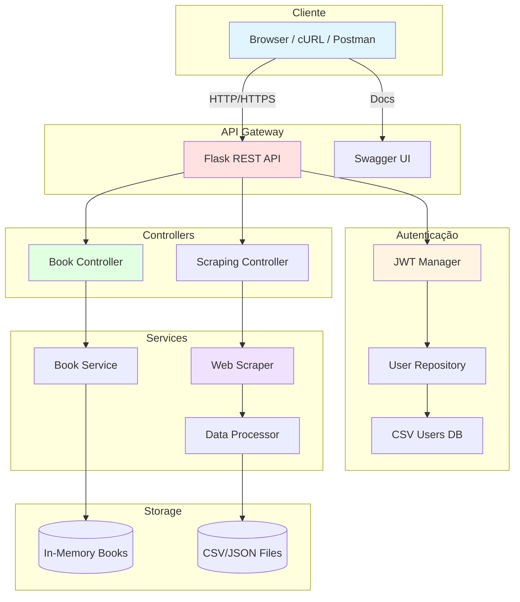

# 📚 FIAP MLE - Book Store Project

> **Tech Challenge** - Pós-Graduação em Machine Learning Engineering - FIAP

[](https://www.python.org/)
[](https://flask.palletsprojects.com/)
[](LICENSE)
[](https://fiap-mle-bookstore-prod-d748bdd0abdc.herokuapp.com)

---

## 🎯 Sobre o Projeto

Este projeto faz parte do **Tech Challenge** do curso de **Pós-Graduação em Machine Learning Engineering** da **FIAP**. É uma solução completa de backend que integra:

1. **API REST** com Flask e autenticação JWT
2. **Web Scraping** automatizado para coleta de dados
3. **Sistema de Autenticação** com controle de acesso por roles (RBAC)

### 🚀 Links Rápidos

| 🔵 **Staging** | 🟢 **Production** |
|---------------|------------------|
| [API](https://fiap-mle-bookstore-staging-d571c9f02bed.herokuapp.com) | [API](https://fiap-mle-bookstore-prod-d748bdd0abdc.herokuapp.com) |
| [Swagger](https://fiap-mle-bookstore-staging-d571c9f02bed.herokuapp.com/api/v1/docs) | [Swagger](https://fiap-mle-bookstore-prod-d748bdd0abdc.herokuapp.com/api/v1/docs) |

**📘 Deployment**: Consulte [DEPLOYMENT.md](DEPLOYMENT.md)

---

## 📖 Documentação

### 🚀 Começando

- **[Quick Start](docs/QUICK_START.md)** - Comece em 5 minutos
- **[Autenticação](docs/AUTHENTICATION.md)** - JWT, Login, Roles
- **[Troubleshooting](docs/TROUBLESHOOTING.md)** - Soluções para problemas comuns

### 🔧 Módulos

- **[API REST](api/README.md)** - Documentação técnica da API
- **[Web Scraper](scraper/README.md)** - Módulo de scraping
- **[Exemplos](examples/README.md)** - Código de exemplo prático

### 🚀 Deploy & DevOps

- **[DEPLOYMENT.md](DEPLOYMENT.md)** - Guia completo de deployment (Staging/Prod)
- **[Docker](docker-compose.yml)** - Containerização

---

## ⚡ Quick Start (TL;DR)

```bash
# 1. Clone e instale
git clone https://github.com/giulianogimenez/FIAP-MLE-book-store.git
cd FIAP-MLE-book-store
python3 -m venv venv
source venv/bin/activate  # Windows: venv\Scripts\activate
pip install -r requirements.txt

# 2. Inicie a API
python run_api.py

# 3. Acesse
# API: http://localhost:5000
# Swagger: http://localhost:5000/api/v1/docs

# 4. Login (usuários padrão)
# admin / admin123  (role: admin)
# user  / user123   (role: user)
```

**📖 Guia detalhado**: [Quick Start](docs/QUICK_START.md)

---

## 🏗️ Arquitetura



---

## 📁 Estrutura do Projeto

```
FIAP-MLE-book-store/
├── 📖 README.md                    # Este arquivo
├── 🚀 DEPLOYMENT.md                # Guia de deployment
│
├── 📂 docs/                        # Documentação geral
│   ├── QUICK_START.md             # Início rápido
│   ├── AUTHENTICATION.md          # JWT e autenticação
│   └── TROUBLESHOOTING.md         # Problemas comuns
│
├── 📂 api/                         # API REST
│   ├── README.md                  # Documentação da API
│   ├── app.py                     # Aplicação Flask
│   ├── routes.py                  # Rotas de Books
│   ├── scraping_routes.py         # Rotas de Scraping
│   ├── auth/                      # Autenticação
│   │   ├── models.py             # User model
│   │   ├── routes.py             # Endpoints auth
│   │   └── decorators.py         # @admin_required
│   └── controllers/               # Lógica de negócio
│       ├── book_controller.py
│       └── scraping_controller.py
│
├── 📂 scraper/                     # Web Scraping
│   ├── README.md                  # Documentação do scraper
│   ├── book_scraper.py           # Scraper de livros
│   ├── data_processor.py         # Processamento de dados
│   └── main.py                   # CLI
│
├── 📂 examples/                    # Exemplos de uso
│   ├── README.md
│   ├── api_examples.py
│   ├── auth_scraping_example.py
│   └── scraper_examples.py
│
├── 📂 tests/                       # Testes unitários
│   ├── test_api.py
│   ├── test_auth.py
│   └── test_scraping.py
│
├── 📂 scripts/                     # Scripts utilitários
│   ├── deploy.sh                 # Deploy automatizado
│   ├── test_env.sh               # Testes de ambiente
│   └── create_user.py            # Gerenciar usuários
│
├── 📂 data/                        # Dados da aplicação
│   ├── users.csv                 # Usuários (JWT)
│   └── output/                   # Scraping outputs
│
├── requirements.txt               # Dependências Python
├── run_api.py                    # Iniciar API
├── run_scraper.py                # Iniciar scraper
├── Procfile                      # Heroku config
└── docker-compose.yml            # Docker setup
```

---

## 🌟 Funcionalidades

### 🔐 Autenticação JWT

- ✅ Login/Register com usuário e senha
- ✅ Access tokens (1h) + Refresh tokens (30 dias)
- ✅ Role-based access control (user/admin)
- ✅ Password hashing com bcrypt

**📖 [Documentação Completa](docs/AUTHENTICATION.md)**

### 📚 API de Livros (Read-Only)

- ✅ Consulta de livros (apenas leitura)
- ✅ Paginação e busca
- ✅ Busca avançada (título + categoria)
- ✅ Listagem de categorias
- ✅ Estatísticas da coleção
- ℹ️ **Adição/Edição/Exclusão apenas via Scraping**

**📖 [Documentação da API](api/README.md)**

### 🕷️ Web Scraping (Fonte de Dados)

- ✅ Coleta automatizada de books.toscrape.com
- ✅ Exportação em JSON, CSV ou ambos
- ✅ Sistema de jobs com rastreamento
- ✅ Execução via API (admin) ou CLI
- ✅ Rate limiting e scraping responsável
- ℹ️ **Única forma de adicionar/modificar livros**

**📖 [Documentação do Scraper](scraper/README.md)**

### 📖 Swagger UI

- ✅ Documentação interativa completa
- ✅ Testes direto no navegador
- ✅ Autenticação JWT integrada
- ✅ Exemplos de request/response

**🔗 [Swagger Staging](https://fiap-mle-bookstore-staging-d571c9f02bed.herokuapp.com/api/v1/docs)** | **[Swagger Production](https://fiap-mle-bookstore-prod-d748bdd0abdc.herokuapp.com/api/v1/docs)**

---

## 🔌 Endpoints Principais

### Autenticação (Público)

| Método | Endpoint | Descrição |
|--------|----------|-----------|
| POST | `/api/v1/auth/login` | Login e obter tokens |
| POST | `/api/v1/auth/refresh` | Renovar access token |
| POST | `/api/v1/auth/register` | Registrar novo usuário |
| GET | `/api/v1/auth/me` | Info do usuário logado |

### Books (Requer Token - Read-Only)

| Método | Endpoint | Descrição |
|--------|----------|-----------|
| GET | `/api/v1/books` | Listar livros (paginação) |
| GET | `/api/v1/books/search` | Buscar (título/categoria) |
| GET | `/api/v1/books/:id` | Buscar por ID |
| GET | `/api/v1/categories` | Listar categorias |
| GET | `/api/v1/stats` | Estatísticas |

> ℹ️ **Nota**: Adição, edição e exclusão de livros são realizadas exclusivamente via scraping.

### Scraping (Requer Admin - Fonte de Dados)

| Método | Endpoint | Descrição |
|--------|----------|-----------|
| POST | `/api/v1/scraping/trigger` | Iniciar scraping (adiciona livros) |
| GET | `/api/v1/scraping/jobs` | Listar jobs |
| GET | `/api/v1/scraping/jobs/:id` | Status do job |

**📖 Documentação completa**: [API README](api/README.md)

---

## 🛠️ Tecnologias

### Backend & API
- **Flask 3.0.0** - Framework web
- **Flask-JWT-Extended 4.5.3** - Autenticação JWT
- **Flasgger 0.9.7.1** - Documentação Swagger
- **Gunicorn 21.2.0** - WSGI server

### Web Scraping
- **requests 2.31.0** - HTTP client
- **beautifulsoup4 4.12.2** - HTML parser
- **pandas 2.1.3** - Processamento de dados

### Deploy & DevOps
- **Heroku** - Cloud platform (Staging + Production)
- **Docker** - Containerização
- **Git** - Controle de versão

**📦 Ver todas**: [requirements.txt](requirements.txt)

---

## 🧪 Testes

```bash
# Todos os testes
pytest

# Com cobertura
pytest --cov=api --cov=scraper --cov-report=html

# Apenas autenticação
pytest tests/test_auth.py -v

# Apenas API
pytest tests/test_api.py -v
```

**Total**: 15+ testes unitários | Cobertura: ~80%

---

## 🚀 Deploy

### Ambientes

- **🔵 Staging**: Testes e validação
- **🟢 Production**: Ambiente estável

### Deploy Automatizado

```bash
# Deploy apenas staging
./scripts/deploy.sh staging

# Deploy staging → production (com testes)
./scripts/deploy.sh production
```

### Testar Ambientes

```bash
# Testar staging
./scripts/test_env.sh staging

# Testar production
./scripts/test_env.sh production
```

**📖 Guia completo**: [DEPLOYMENT.md](DEPLOYMENT.md)

---

## 📊 Informações do Projeto

| Informação | Detalhes |
|------------|----------|
| **Instituição** | FIAP |
| **Curso** | Pós-Graduação em ML Engineering |
| **Projeto** | Tech Challenge - Book Store API |
| **Versão** | 2.0.0 |
| **Python** | 3.11+ |
| **Status** | ✅ Em Produção |
| **Endpoints** | 16+ |
| **Testes** | 15+ |

### 🔗 Links Importantes

- 🌐 **Staging**: https://fiap-mle-bookstore-staging-d571c9f02bed.herokuapp.com
- 🟢 **Production**: https://fiap-mle-bookstore-prod-d748bdd0abdc.herokuapp.com
- 💻 **GitHub**: https://github.com/giulianogimenez/FIAP-MLE-book-store
- 📖 **Swagger**: [Staging](https://fiap-mle-bookstore-staging-d571c9f02bed.herokuapp.com/api/v1/docs) | [Production](https://fiap-mle-bookstore-prod-d748bdd0abdc.herokuapp.com/api/v1/docs)

---

## 🤝 Contribuindo

1. Fork o projeto
2. Crie uma branch (`git checkout -b feature/NovaFeature`)
3. Commit suas mudanças (`git commit -m 'Add NovaFeature'`)
4. Push para a branch (`git push origin feature/NovaFeature`)
5. Abra um Pull Request

---

## 📞 Suporte

Para dúvidas ou problemas:

1. **Consulte a documentação**:
   - [Quick Start](docs/QUICK_START.md)
   - [Troubleshooting](docs/TROUBLESHOOTING.md)
   - [API Docs](api/README.md)

2. **Abra uma Issue**: [GitHub Issues](https://github.com/giulianogimenez/FIAP-MLE-book-store/issues)

---

## 📄 Licença

Este projeto é para fins educacionais - FIAP MLE.

---

<div align="center">

**🚀 Versão 2.0.0 | 📅 Novembro 2025**

**✅ Desenvolvido como parte do Tech Challenge - FIAP Machine Learning Engineering**

---

**[🚀 Quick Start](docs/QUICK_START.md)** | 
**[📖 API Docs](api/README.md)** | 
**[🕷️ Scraper](scraper/README.md)** | 
**[🚀 Deploy](DEPLOYMENT.md)**

</div>
