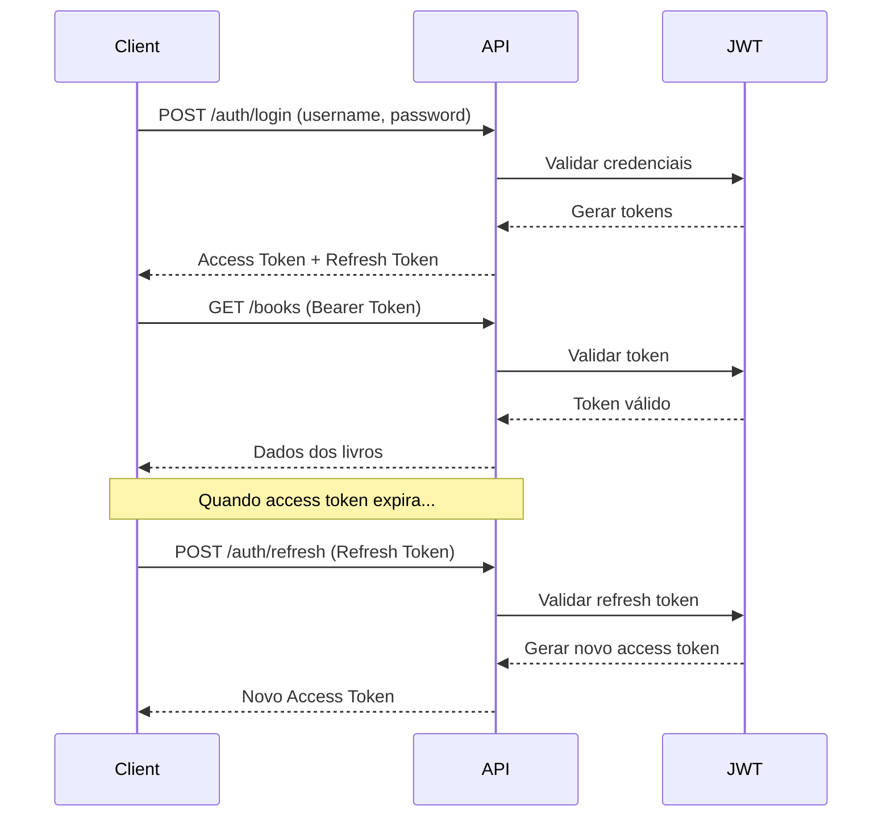

# 🔐 Autenticação JWT

Guia completo sobre autenticação e autorização no Book Store API.

## 📋 Índice

- [Visão Geral](#visão-geral)
- [Usuários Padrão](#usuários-padrão)
- [Endpoints de Autenticação](#endpoints-de-autenticação)
- [Como Usar JWT](#como-usar-jwt)
- [Roles e Permissões](#roles-e-permissões)
- [Gerenciamento de Usuários](#gerenciamento-de-usuários)

## Visão Geral

A API utiliza **JWT (JSON Web Tokens)** para autenticação. Existem dois tipos de tokens:

- **Access Token**: Válido por 1 hora, usado em todas as requisições
- **Refresh Token**: Válido por 30 dias, usado para renovar o access token

### Fluxo de Autenticação



## Usuários Padrão

A aplicação vem com dois usuários pré-configurados em `data/users.csv`:

| Usuário | Senha | Role | Permissões |
|---------|-------|------|------------|
| `admin` | `admin123` | admin | Acesso completo + Scraping |
| `user` | `user123` | user | Apenas consulta de livros |

> ⚠️ **Importante**: Em produção, altere essas senhas!

## Endpoints de Autenticação

### POST /api/v1/auth/login

Autentica usuário e retorna tokens JWT.

**Request:**
```bash
curl -X POST http://localhost:5000/api/v1/auth/login \
  -H "Content-Type: application/json" \
  -d '{
    "username": "admin",
    "password": "admin123"
  }'
```

**Response (200 OK):**
```json
{
  "access_token": "eyJhbGciOiJIUzI1NiIsInR5cCI6IkpXVCJ9...",
  "refresh_token": "eyJhbGciOiJIUzI1NiIsInR5cCI6IkpXVCJ9...",
  "user": {
    "username": "admin",
    "role": "admin"
  },
  "message": "Login successful"
}
```

**Response (401 Unauthorized):**
```json
{
  "error": "Invalid credentials",
  "message": "Username or password is incorrect"
}
```

### POST /api/v1/auth/refresh

Renova o access token usando o refresh token.

**Request:**
```bash
curl -X POST http://localhost:5000/api/v1/auth/refresh \
  -H "Authorization: Bearer <refresh_token>"
```

**Response (200 OK):**
```json
{
  "access_token": "eyJhbGciOiJIUzI1NiIsInR5cCI6IkpXVCJ9...",
  "message": "Token refreshed successfully"
}
```

### GET /api/v1/auth/me

Retorna informações do usuário autenticado.

**Request:**
```bash
curl http://localhost:5000/api/v1/auth/me \
  -H "Authorization: Bearer <access_token>"
```

**Response (200 OK):**
```json
{
  "user": {
    "username": "admin",
    "role": "admin"
  }
}
```

### POST /api/v1/auth/register

Registra um novo usuário (role padrão: user).

**Request:**
```bash
curl -X POST http://localhost:5000/api/v1/auth/register \
  -H "Content-Type: application/json" \
  -d '{
    "username": "novousuario",
    "password": "senha123"
  }'
```

**Response (201 Created):**
```json
{
  "message": "User created successfully",
  "user": {
    "username": "novousuario",
    "role": "user"
  }
}
```

## Como Usar JWT

### 1. Obter Token

```bash
# Login
curl -X POST http://localhost:5000/api/v1/auth/login \
  -H "Content-Type: application/json" \
  -d '{"username":"admin","password":"admin123"}' \
  | jq -r '.access_token' > token.txt

# Salvar em variável
TOKEN=$(cat token.txt)
```

### 2. Usar em Requisições

```bash
# GET com autenticação
curl http://localhost:5000/api/v1/books \
  -H "Authorization: Bearer $TOKEN"

# POST com autenticação
curl -X POST http://localhost:5000/api/v1/books \
  -H "Authorization: Bearer $TOKEN" \
  -H "Content-Type: application/json" \
  -d '{"title":"Livro","author":"Autor","isbn":"123","price":29.99}'
```

### 3. Renovar Token Expirado

```bash
# Usar refresh token
curl -X POST http://localhost:5000/api/v1/auth/refresh \
  -H "Authorization: Bearer $REFRESH_TOKEN" \
  | jq -r '.access_token' > token.txt
```

### 4. Python

```python
import requests

# Login
response = requests.post(
    "http://localhost:5000/api/v1/auth/login",
    json={"username": "admin", "password": "admin123"}
)

# Extrair tokens
data = response.json()
access_token = data['access_token']
refresh_token = data['refresh_token']

# Usar em requisições
headers = {"Authorization": f"Bearer {access_token}"}

# Fazer requisições
books = requests.get(
    "http://localhost:5000/api/v1/books",
    headers=headers
)

# Renovar token quando expirar
def refresh_access_token(refresh_token):
    response = requests.post(
        "http://localhost:5000/api/v1/auth/refresh",
        headers={"Authorization": f"Bearer {refresh_token}"}
    )
    return response.json()['access_token']
```

## Roles e Permissões

### Roles Disponíveis

1. **user** (Usuário Regular)
   - ✅ Consultar livros (GET /books)
   - ✅ Buscar livros (GET /books/search)
   - ✅ Ver categorias (GET /categories)
   - ✅ Criar/editar/deletar livros
   - ❌ Executar scraping

2. **admin** (Administrador)
   - ✅ Todas as permissões de user
   - ✅ Executar scraping (POST /scraping/trigger)
   - ✅ Listar jobs de scraping (GET /scraping/jobs)
   - ✅ Ver status de jobs (GET /scraping/jobs/:id)

### Decorator @admin_required

Endpoints protegidos por `@admin_required` só podem ser acessados por usuários com role `admin`:

```python
@scraping_bp.route('/trigger', methods=['POST'])
@jwt_required()
@admin_required()
def trigger_scraping():
    # Apenas admins podem acessar
    pass
```

**Tentativa de acesso sem permissão (403 Forbidden):**
```json
{
  "error": "Admin access required",
  "message": "You must be an admin to access this endpoint"
}
```

## Gerenciamento de Usuários

### Via Script CLI

```bash
# Listar usuários
python scripts/create_user.py list

# Criar usuário regular
python scripts/create_user.py create -u joao -p senha123

# Criar administrador
python scripts/create_user.py create -u maria -p senha456 -r admin
```

### Via API

```bash
# Registrar novo usuário (role: user)
curl -X POST http://localhost:5000/api/v1/auth/register \
  -H "Content-Type: application/json" \
  -d '{
    "username": "novousuario",
    "password": "senha123"
  }'
```

### Arquivo users.csv

Usuários são armazenados em `data/users.csv`:

```csv
username,password_hash,role
admin,$2b$12$...,admin
user,$2b$12$...,user
```

## 🔒 Segurança

### Senhas

- Senhas são hasheadas com **bcrypt** antes de serem armazenadas
- Custo do hash: 12 rounds (padrão bcrypt)
- Nunca armazene senhas em plain text

### Tokens JWT

- **Algorithm**: HS256
- **Access Token Expiration**: 1 hora
- **Refresh Token Expiration**: 30 dias
- **Secret Key**: Configurável via variável de ambiente `JWT_SECRET_KEY`

### Gerar Chave Segura

```bash
# Gerar chave aleatória para JWT
python -c "import secrets; print(secrets.token_hex(32))"

# Adicionar ao .env
echo "JWT_SECRET_KEY=sua_chave_gerada_aqui" >> .env
echo "SECRET_KEY=outra_chave_segura" >> .env
```

### Boas Práticas

1. **Nunca** commite tokens ou senhas no Git
2. **Sempre** use HTTPS em produção
3. **Altere** as senhas padrão antes de ir para produção
4. **Rotacione** chaves JWT periodicamente
5. **Implemente** rate limiting em produção
6. **Monitore** tentativas de login falhadas

## 🐛 Troubleshooting

### Token Expirado

```json
{
  "msg": "Token has expired"
}
```

**Solução**: Use o refresh token para obter novo access token.

### Token Inválido

```json
{
  "msg": "Invalid token"
}
```

**Soluções**:
- Verifique se o token está completo
- Certifique-se de usar `Bearer` no header
- Gere um novo token fazendo login novamente

### Credenciais Inválidas

```json
{
  "error": "Invalid credentials"
}
```

**Soluções**:
- Verifique username e password
- Certifique-se que o usuário existe em `data/users.csv`

### Acesso Negado (403)

```json
{
  "error": "Admin access required"
}
```

**Solução**: Apenas admins podem acessar este endpoint. Faça login com usuário admin.

---

**📖 Ver também:**
- [Quick Start](QUICK_START.md)
- [Endpoints Detalhados](ENDPOINTS.md)
- [Troubleshooting](TROUBLESHOOTING.md)

